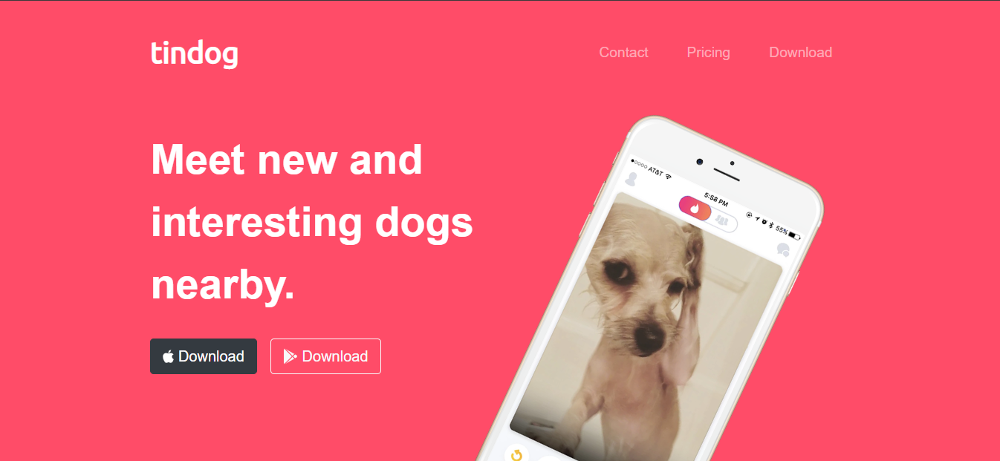
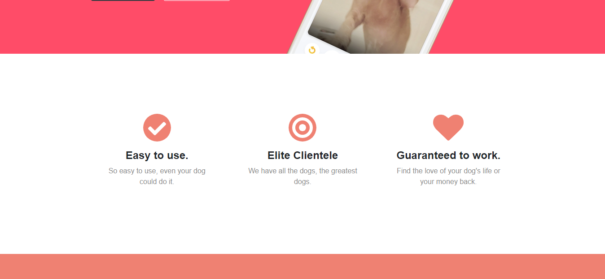
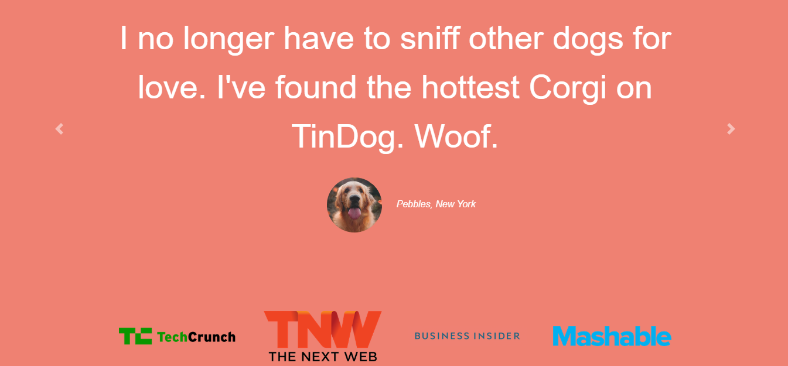
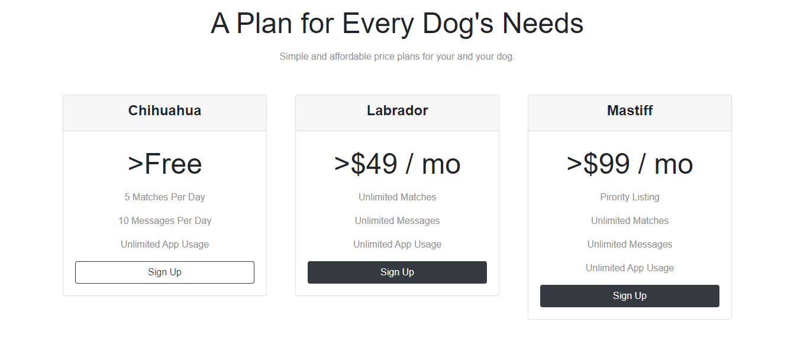
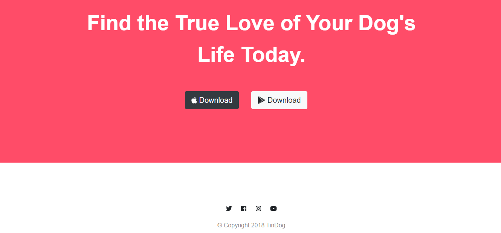

# TinDog Website
This project was created based on the learnt on HTML, CSS and Bootstrap recently by me

## Table of Contents
* [General Info](#general-information)
* [Technologies Used](#technologies-used)
* [Screenshots](#screenshots)
* [Acknowledgements](#acknowledgements)
* [Contact](#contact)
<!-- * [License](#license) -->

## General Information
- through creating this project I got more familiar with current technologies and learnt how to use them in the projects.

<!-- You don't have to answer all the questions - just the ones relevant to your project. -->

## Technologies Used
- HTML
- CSS
- Bootstarp 4.0

## Screenshots

<!-- If you have screenshots you'd like to share, include them here. -->

## Acknowledgements
Give credit here.
- This project was inspired by old version of website Tindogs
- This project was based on [100 Days of Code: The Complete Python Pro Bootcamp for 2023
](https://www.udemy.com).
- Many thanks to Angela Yu

## Contact
Created by Ilkhomjon - feel free to contact me!

<!-- Optional -->
<!-- ## License -->
<!-- This project is open source and available under the [... License](). -->

<!-- You don't have to include all sections - just the one's relevant to your project -->
